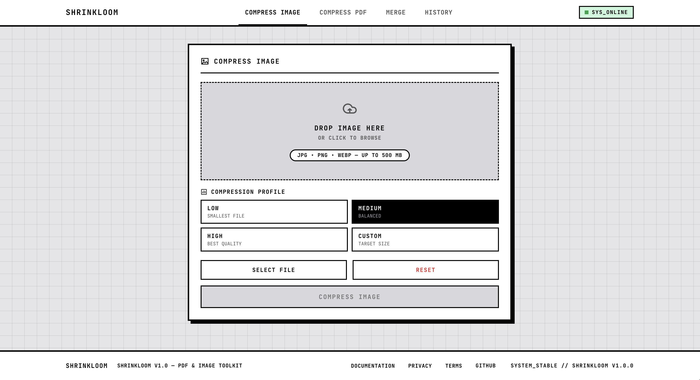

<div align="center">

# Shrinkloom

**PDF & Image Toolkit — Merge, Compress, Convert, Done.**

A full-stack web app with 5 tools: **Merge PDF**, **Compress PDF**, **Compress Image**, **PDF → Word**, and **Word → PDF**.
Built with React 19 + Vite 6 on the frontend, Node.js + Express 5 on the backend.
Ghostscript for PDF processing, Sharp for image processing, pdf2docx + LibreOffice for conversion.


</div>

---

## Screenshot

<div align="center">



*Compress Image — drag-and-drop upload with profile selection and custom target-size mode*

</div>

---

## Features

### Merge PDF
- Upload multiple PDF files via drag-and-drop
- Reorder files before merging (drag handles)
- Order override via API (`[2, 0, 1]` JSON array)
- Magic-byte validation — rejects non-PDF files even if renamed
- Returns merged PDF with `X-Merged-Pages` header

### Compress PDF
- 3 preset profiles: **Low** (smallest), **Medium** (balanced), **High** (best quality)
- **Custom mode**: set target size (MB) or quality (0–100)
- Ghostscript-powered with QFactor-based distiller params
- Binary search on DPI for target-size mode
- 120s process timeout, `execFile` array args (no shell injection)

### Compress Image
- Supports **JPEG**, **PNG**, **WebP** (preserves original format)
- 3 preset profiles: **Low**, **Medium**, **High**
- **Custom mode**: target size (KB) with binary search on quality
- Format-aware encoding — PNG stays PNG, WebP stays WebP
- Early rejection of unsupported/corrupt files via Sharp decode

### PDF → Word
- Convert PDF to editable DOCX
- Powered by pdf2docx (Python)
- Preserves text, layouts, tables, and images

### Word → PDF
- Convert DOCX/DOC to PDF
- Powered by LibreOffice headless
- Preserves formatting, fonts, and layout

### Security Hardening
- **Rate limiting**: 30 requests per IP per 15 minutes via `express-rate-limit`
- **Concurrency cap**: max 3 simultaneous processing jobs via `p-limit`
- **Security headers**: Helmet (HSTS, X-Frame-Options, X-Content-Type-Options, Referrer-Policy)
- **CORS**: restricted to allowed origins (not wide-open `*`)
- **No shell injection**: all subprocess calls use `execFile` with array args
- **Temp file cleanup**: try/finally + scheduled TTL sweep (1 hour)
- **Generic error responses**: no stack traces leaked to client
- **`/health` endpoint**: `{"status":"ok","uptime":...}` for uptime monitoring

---

## Tech Stack

| Layer | Technology | Version |
|---|---|---|
| Frontend | React | 19 |
| Build Tool | Vite | 6 |
| Routing | react-router-dom | 7 |
| CSS | Custom (arcade theme) | — |
| Backend | Node.js + Express | 5 |
| PDF Merge | pdf-lib | 1.17 |
| PDF Compress | Ghostscript (`gs`) | 10.x |
| Image Compress | Sharp | 0.35 |
| PDF → Word | pdf2docx (Python) | 0.5 |
| Word → PDF | LibreOffice | — |
| Upload | Multer | 2.0 |
| Security | Helmet + express-rate-limit + p-limit | latest |

---

## Project Structure

```
Shrinkloom/
├── backend/
│   ├── src/
│   │   ├── server.js              # Express app, routes, middleware
│   │   ├── middleware/upload.js    # Multer config (500MB/file, 500MB total)
│   │   ├── pdf/
│   │   │   ├── merge.js           # pdf-lib merge with order override
│   │   │   ├── compress.js        # Ghostscript PDF compression
│   │   │   └── convert.js         # PDF↔Word conversion
│   │   └── image/
│   │       └── compress.js        # Sharp image compression
│   ├── scripts/
│   │   └── pdf2docx_convert.py    # Python PDF→Word helper
│   ├── test/smoke.mjs             # Smoke tests
│   ├── scripts/make-pdf.mjs       # Test PDF fixture generator
│   └── package.json
├── frontend/
│   ├── src/
│   │   ├── App.jsx                # Router, navbar, footer, history
│   │   ├── main.jsx               # React entry
│   │   ├── styles.css             # Arcade theme CSS
│   │   ├── components/
│   │   │   ├── Icon.jsx           # Inline SVG icons
│   │   │   ├── ui.jsx             # DropZone, FileQueue, ProfileGrid, OutputPanel
│   │   │   └── InfoModal.jsx      # Info modal
│   │   ├── tools/
│   │   │   ├── Merge.jsx          # Merge PDF page
│   │   │   ├── Compress.jsx       # Compress PDF/Image page
│   │   │   └── Convert.jsx        # PDF↔Word conversion page
│   │   └── pages/
│   │       ├── DocsPage.jsx       # API documentation
│   │       ├── PrivacyPage.jsx    # Privacy policy
│   │       └── TermsPage.jsx      # Terms of use
│   ├── vite.config.js             # Dev proxy /api → :3000
│   └── package.json
├── deploy/
│   └── setup-vm.sh                # One-command VPS setup
├── docs/
│   ├── api.md                     # API contract
│   ├── architecture.md            # System design
│   ├── system.md                  # Requirements
│   ├── tech.md                    # Technology choices
│   ├── security.md                # Security hardening guide
│   ├── setup.md                   # Dev/deploy setup instructions
│   └── screenshots/               # README screenshots
└── README.md
```

---

## Quick Start

### Prerequisites
- Node.js >= 18
- Ghostscript (`gs`) installed and on PATH
- Python 3 + venv (for PDF→Word)
- LibreOffice (for Word→PDF, optional on Linux)

```bash
# macOS
brew install ghostscript
brew install --cask libreoffice

# Ubuntu/Debian
sudo apt install ghostscript libreoffice-core libreoffice-writer python3-venv python3-pip
```

### Backend

```bash
cd backend
python3 -m venv .venv
.venv/bin/pip install pdf2docx
npm install
npm run dev          # starts on http://localhost:3000
```

### Frontend

```bash
cd frontend
npm install
npm run dev          # starts on http://localhost:5173
```

The Vite dev server proxies `/api/*` to the backend automatically.

---

## One-Command Deploy (recovery)

[`deploy/setup-vm.sh`](deploy/setup-vm.sh) rebuilds the entire project on a fresh Ubuntu VM (Oracle Cloud, any Ubuntu/Debian box): installs Node, Ghostscript, LibreOffice, the Python venv + pdf2docx, nginx and PM2; clones the repo; installs dependencies; builds the frontend; writes `.env`; starts the app; and configures nginx. Run it after SSHing into a clean VM:

```bash
bash -c "curl -fsSL https://raw.githubusercontent.com/anshul1058/Shrinkloom/main/deploy/setup-vm.sh -o /tmp/setup-vm.sh && bash /tmp/setup-vm.sh https://github.com/anshul1058/Shrinkloom.git"
```

This is the answer to "can I delete the project and get it all back" — yes. The script is designed to run from a bare VM and is the single source of truth for setup. In production the Express server also serves the built frontend (`frontend/dist`) on the same port when present, so one box hosts both API and UI; nginx just proxies port 80 → 3000.

---

## API Reference

| Endpoint | Method | Description |
|---|---|---|
| `/health` | GET | Health check — `{"status":"ok"}` |
| `/api/merge` | POST | Merge multiple PDFs (multipart, `files[]` + optional `order`) |
| `/api/compress/pdf` | POST | Compress a PDF (multipart, `file` + `profile`) |
| `/api/compress/image` | POST | Compress an image (multipart, `file` + `profile`) |
| `/api/convert/pdf-to-word` | POST | Convert PDF to DOCX (multipart, `file`) |
| `/api/convert/word-to-pdf` | POST | Convert DOCX to PDF (multipart, `file`) |

### Compression Profiles

| Profile | PDF Behavior | Image Behavior |
|---|---|---|
| `low` | Aggressive compression, ~72 DPI | Quality 35, max-width 1280 |
| `medium` | Balanced, ~150 DPI | Quality 65 |
| `high` | Light compression, ~300 DPI | Quality 88 |
| `custom` | `targetSizeMB` or `quality` (0–100) | `targetSizeKB`, `quality`, or `maxWidth` |

### Upload Limits
- **Per file**: 500 MB
- **Total**: 500 MB
- **Max files**: 20

### Error Format
```json
{
  "error": "Something went wrong.",
  "code": "INVALID_REQUEST"
}
```

| Code | Status | Meaning |
|---|---|---|
| `INVALID_REQUEST` | 400 | Bad params, non-PDF, fewer than 2 files |
| `UPLOAD_TOO_LARGE` | 413 | Exceeds size limits |
| `PROCESSING_FAILED` | 422 | Corrupt file, compress failed |
| `SERVICE_UNAVAILABLE` | 503 | Ghostscript or LibreOffice not installed |
| `RATE_LIMITED` | 429 | Too many requests |

---

## Running Tests

```bash
cd backend
npm run test    # or: node test/smoke.mjs
```

Tests cover: merge, single-file reject, image compress (profiles + target size), PDF compress (all profiles + custom quality).

---

## Security Checklist

- [x] File size limit (multer — 500MB)
- [x] Rate limiting on all `/api/*` routes (30 req/15min/IP)
- [x] Concurrency cap (3 max jobs via p-limit)
- [x] Process timeout on Ghostscript (120s)
- [x] `execFile` with array args — no `exec()` with string concat
- [x] MIME/magic-byte validation on uploads
- [x] Temp files always cleaned up (try/finally + cron sweep)
- [x] CORS restricted to allowed origins
- [x] `helmet` security headers
- [x] Generic error responses (no stack traces)
- [x] `/health` endpoint
- [x] `npm audit` — 0 vulnerabilities

See [docs/security.md](docs/security.md) for the full security hardening guide.

---

## License

MIT
